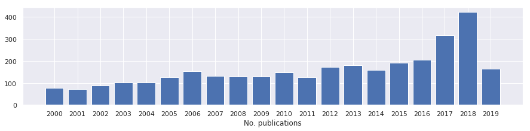
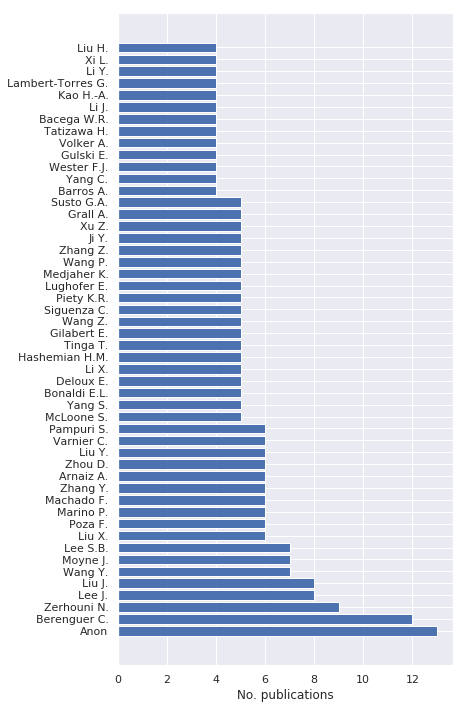
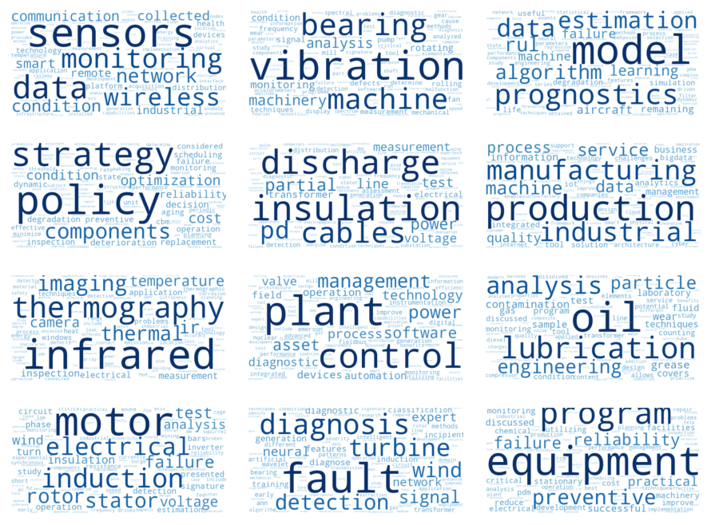
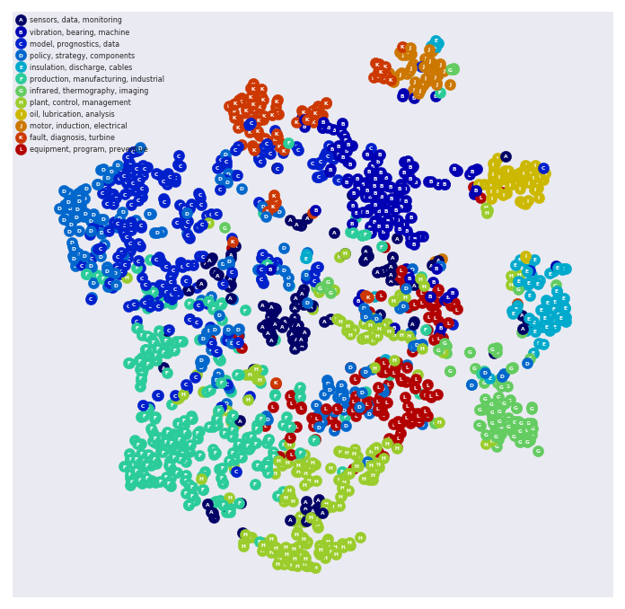

# Automated Literature Analysis 
[](https://zenodo.org/badge/latestdoi/206312286)

This repository shows an example of how to perform an automated analysis of academic literature using Jupyter notebooks and online citation databases such as Scopus, DBLP, and Semantic Scholar. This analysis detects the number of publications over time, popular authors, popular venues, popular affiliations, and popular "topics" that appear within the documents' abstracts (detected using natural language processing).


## Requirements
The required Python packages can be found in `requirements.txt`. Creating a virtual Python environment is recommended (for example, `virtualenv` or `conda`). The notebook has been tested using Python 3.6. 

Scopus is a citation database of peer-reviewed literature from scientific journals, books, and conference proceedings.
To utilize the Scopus API, you (or your institute) needs a Scopus subscription and you must request an Elsevier Developer API key (see [Elsevier Developers](https://dev.elsevier.com/sc_apis.html) and [Scopus Python API](https://scopus.readthedocs.io/en/latest/) for more information). 


# Running using virtualenv
Installation using `virtualenv` is can be using the following commands:

Create virtualenv environment named myenv:
```
virtualenv myenv --python=`which python3`
```

Activate virtual environment
```
source ./myenv/bin/activate
```

Install requirement dependencies.
```
pip3 install -r requirements.txt
```

Install new Jupyter kernel.
```
ipython kernel install --user --name=myenv
```

Run Jupyter and select `myenv` as kernel. Remaining instructions can be found within the notebook itself.
```
jupyter notebook literature_analysis.ipynb --MappingKernelManager.default_kernel_name=myenv
```


## Examples
Below are examples of the notebook's output for the query `title-abs-key("predictive maintenance")`.




*Publications per year.*




*Top 50 authors.*


*Top 50 publication venues.*




*Detected topics visualized as word clouds.*




*Publications embedded into 2D space based on text similarity. Each publication is labeled with its dominant topic.*
